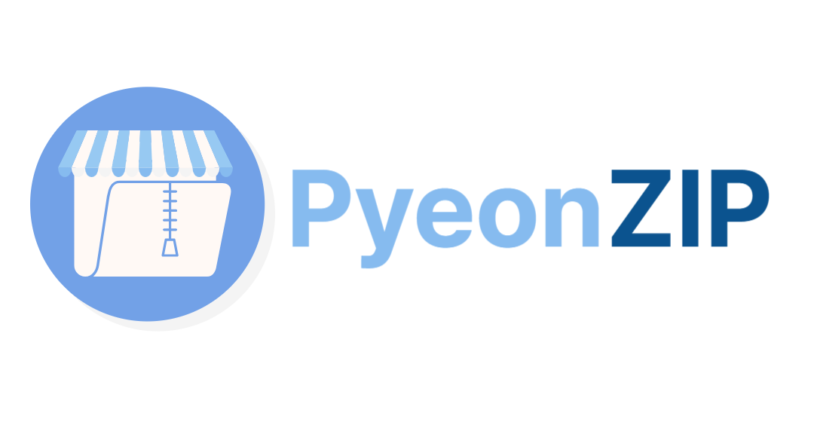
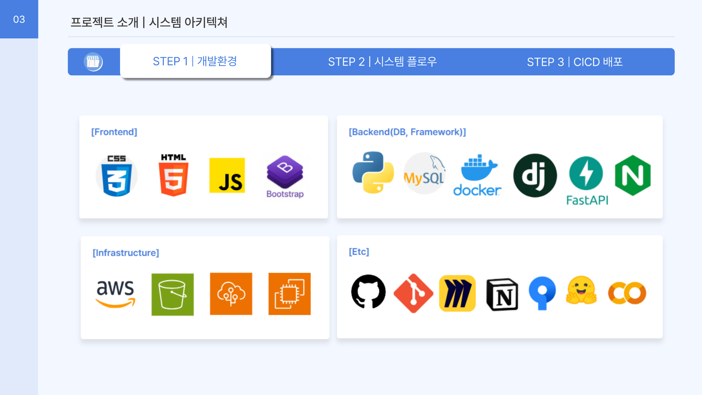
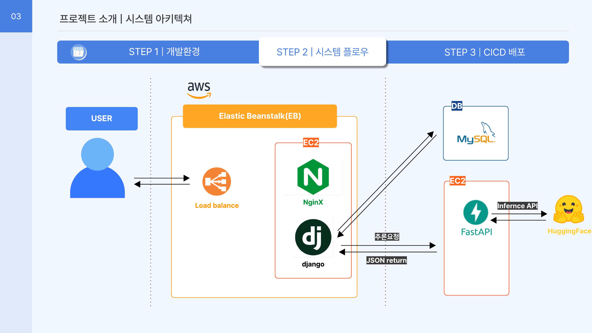
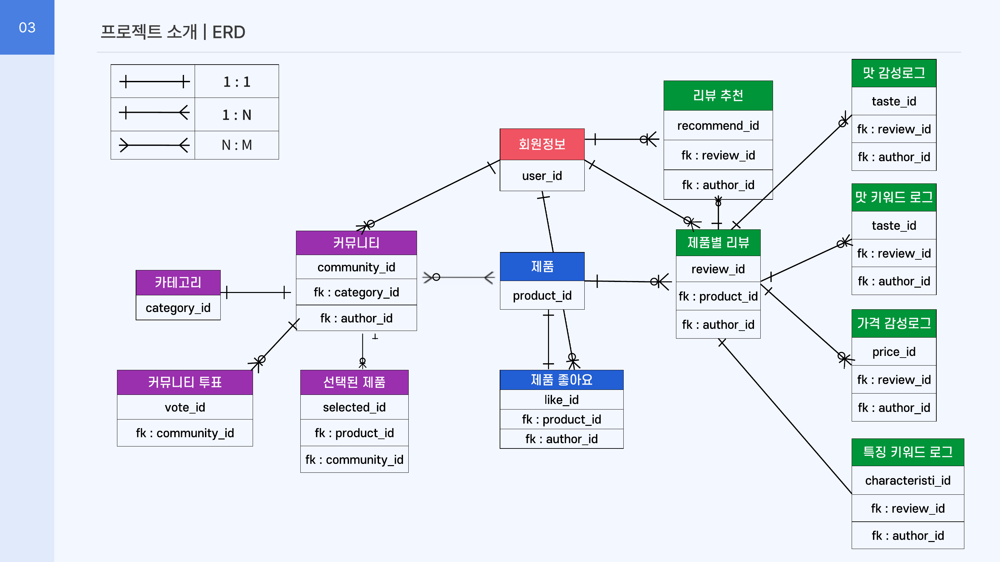
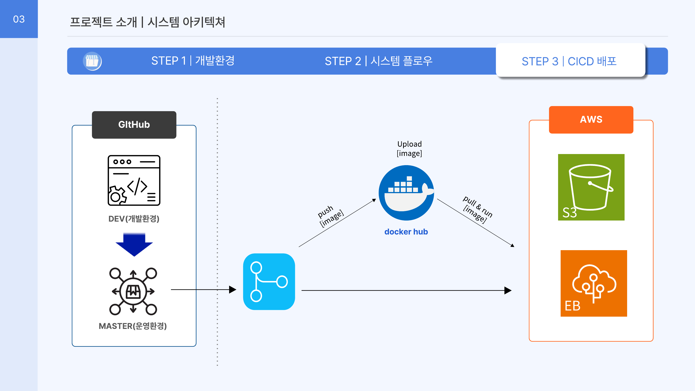

<p align="center">
  
</p>

<div align="center">

### 편의점 신상 리뷰, 여기 다 ZIP중!

**VoC(Voice of Customer) 기반 편의점 신상품 리뷰 · AI 감성분석 서비스**

AI 프로젝트 글로벌표준 기반의 풀스택 딥러닝 활용 SW 개발자 양성과정 7기

프로젝트 기간: 2025.01.17 ~ 2025.03.14

팀원: 김해빈 · 김혜영 · 김희애 · 허채연

</div>

<br/>

## 목차

1. [팀 구성](#1-팀-구성)
2. [프로젝트 개요](#2-프로젝트-개요)
3. [기술 스택](#3-기술-스택)
4. [시스템 아키텍처](#4-시스템-아키텍처)
5. [리포지토리 구성](#5-리포지토리-구성)
6. [코드 구조 (본 저장소 · Web)](#6-코드-구조-본-저장소--web)
7. [데이터베이스 설계 (ERD)](#7-데이터베이스-설계-erd)
8. [AI 모델 설계](#8-ai-모델-설계)
9. [핵심 기능](#9-핵심-기능)
10. [CI/CD & 배포](#10-cicd--배포)
11. [실행 방법](#11-실행-방법)
12. [기대효과 및 향후 개선점](#12-기대효과-및-향후-개선점)

<br/>

## 1. 팀 구성

**BE/FE 기능 개발(상품 · 리뷰 · 커뮤니티 등)은 팀원 전원이 공통으로 참여**

| 이름 | 메인 역할 |
|---|---|
| **김해빈** (팀장) | 프로젝트 총괄, AI 모델 설계·학습·서빙 |
| 허채연 | DB 설계, ERD, 마이그레이션 관리 |
| 김혜영 | FE UI/UX 개선 |
| 김희애 | 데이터 크롤링, QA |

<br/>

## 2. 프로젝트 개요

편의점 신상품은 매주 쏟아지지만, 상품에 대한 소비자 반응(VoC)은 각 편의점 앱·SNS·블로그에 파편화되어 있어 소비자도, 본사(MD)도 신뢰할 수 있는 통합된 정보를 얻기 어렵습니다.

**편ZIP**은 CU · GS25 · 7-ELEVEN 신상품 리뷰를 한곳에 모으고, 리뷰 문장을 AI로 감성분석·키워드 추출하여 "맛/가격 점수"와 "특징 태그"로 요약해 제공하는 웹 서비스입니다.

| 관점 | 문제 | 편ZIP의 해결 |
|---|---|---|
| 소비자(B2C) | 편의점별 개별 사이트에 리뷰가 분산되어 있고, 광고·협찬 리뷰로 신뢰도가 낮음 | 여러 편의점 신상품을 한 곳에서 검색하고, 실사용자 리뷰를 AI가 객관적 지표(맛/가격 점수, 긍·부정 키워드)로 요약해서 제공 |
| 생산자(B2B) | 신상품 기획·마케팅에 활용할 소비자 반응 데이터 확보가 어려움 | 상품별·편의점별 리뷰를 관리자 페이지에서 집계해 VoC 리포트로 활용 (긍부정 추이, 경쟁사 대비 비교) |

**핵심 아이디어**: 리뷰 도메인(맛/가격)에 특화된 커스텀 토크나이저 + BERT 파인튜닝으로 일반 감성분석 모델보다 편의점 리뷰 문체(신조어, 축약어)에 강한 감성분석 모델을 자체 구축했습니다.

<br/>

## 3. 기술 스택



| 구분 | 스택 |
|---|---|
| Frontend | HTML5, CSS3, JavaScript, Bootstrap |
| Backend (Web) | Python, Django 5.1, Gunicorn, MySQL |
| Backend (AI Serving) | FastAPI, Uvicorn |
| AI / NLP | PyTorch, HuggingFace Transformers, Sentence-Transformers, KeyBERT |
| Infra / Deploy | AWS Elastic Beanstalk, EC2, S3, RDS(MySQL), Docker, Docker Hub, Nginx |
| 인증 | django-allauth (네이버 · 카카오 소셜 로그인) |
| 협업 | GitHub, GitHub Actions, Notion, Jira 계열 툴, Discord/카카오톡, Confluence |

<br/>

## 4. 시스템 아키텍처

편ZIP은 **Web 서버(Django)** 와 **AI 추론 서버(FastAPI)** 를 분리한 2-서버 구조입니다. 사용자 요청은 Django가 처리하고, 리뷰 문장에 대한 감성분석/키워드 추출이 필요할 때만 내부적으로 FastAPI에 추론을 요청합니다.



```
User → ALB(Load Balancer) → EC2(Nginx → Django/Gunicorn, Elastic Beanstalk)
                                   │  추론요청(JSON) / JSON return
                                   ▼
                            EC2(FastAPI) → HuggingFace Inference API (감성분석 모델)
                                          → 로컬 KeyBERT + Sentence-Transformer (키워드 추출)
Django ──────────────────────────────────→ RDS(MySQL)
Django(media) ───────────────────────────→ S3
```

- **Web 서버(본 저장소, `DA36-final-web-pzip-repo`)**: Django 앱. 상품/리뷰/커뮤니티/유저 도메인과 관리자(VoC 리포트)를 담당하며, MySQL(RDS)에 데이터를 저장하고 이미지/미디어는 S3에 저장합니다.
- **AI 서버(`DA36-final-ai-pzip-repo`)**: FastAPI 앱. 감성분석은 HuggingFace Hub에 배포된 자체 파인튜닝 모델(`klue/bert-base` 기반)을 Inference API로 호출하고, 키워드 추출은 KeyBERT(`intfloat/multilingual-e5-large`)로 로컬에서 직접 추론합니다.
- 두 서버는 REST(JSON)로 통신하며, Django `AI_SERVER_URL` 환경변수로 FastAPI 엔드포인트를 가리킵니다.

<br/>

## 5. 리포지토리 구성

편ZIP은 두 개의 저장소로 구성됩니다.

| 저장소 | 역할 | 주요 기술 |
|---|---|---|
| `DA36-final-web-pzip-repo` (본 저장소) | 사용자 대면 웹 서비스, 관리자(VoC 리포트) | Django, MySQL, S3 |
| `DA36-final-ai-pzip-repo` | 감성분석·키워드 추출 추론 API 서버 | FastAPI, PyTorch, HuggingFace, KeyBERT |

<br/>

## 6. 코드 구조 (본 저장소 · Web)

Django 앱을 도메인 단위로 분리하고, 각 앱 내부는 `controller / service / repository / entity` 레이어로 구성하는 **레이어드 아키텍처**를 사용합니다. Service/Repository는 싱글턴(`get_instance()`) 패턴으로 구현되어 있습니다.

```
pyeonzip_project/
├── pyeonzip/                 # 프로젝트 설정 (settings, urls, wsgi/asgi)
│   ├── settings.py           # 공통 설정 (dev 기본값)
│   ├── settings_dev.py       # 개발 환경
│   └── settings_prod.py      # 운영 환경 (AWS EB 배포용)
│
├── product/                  # 상품 도메인
│   ├── controller/           #   - 상품 검색/조회/필터/좋아요 view
│   ├── service/               #   - ProductService (find_all, ai_product, ai_score_count …)
│   ├── repository/           #   - ORM 쿼리 캡슐화
│   └── entity/models.py      #   - Product, ProductLikes
│
├── review/                   # 리뷰 · AI 분석 도메인
│   ├── controller/review_views.py   # 리뷰 작성/추천, AI 감성분석 트리거 API
│   ├── service/
│   │   ├── review_service.py        #   - 리뷰 CRUD
│   │   ├── sentiment_service.py     #   - FastAPI 감성분석(/analyze_taste, /analyze_cost) 클라이언트
│   │   ├── keyword_service.py       #   - FastAPI 키워드추출(/extract_keywords_hf) 클라이언트
│   │   └── upload_service.py        #   - S3 이미지 업로드
│   └── entity/models.py             #   - Review, PriceLog, TasteLog, ConvenienceLog, TasteKeywordLog
│
├── community/                # 커뮤니티(아이디어 제안 · 투표) 도메인
│   ├── controller/community_views.py
│   ├── service/community_service.py
│   └── entity/models.py      #   - Community, CommunityVoters, Category
│
├── users/                    # 회원 도메인 (소셜 로그인, 마이페이지)
│   ├── controller/{views,mypage_views,mywrite_views}.py
│   ├── service/upload_profile.py
│   └── entity/models.py      #   - UserDetail (Django User 확장)
│
├── templates/                 # Django 템플릿 (서버사이드 렌더링)
├── static/ · staticfiles/     # CSS/JS/이미지 (whitenoise로 서빙)
├── media/                     # 사용자 업로드 리소스 (운영 시 S3로 대체)
├── sql/                       # DB 관련 스크립트
├── gunicorn.conf.py           # 운영 WSGI 서버 설정
├── Dockerfile                 # Python 3.12 기반 컨테이너 이미지
└── manage.py
```

### 리뷰 작성 → AI 분석 데이터 흐름

1. 사용자가 리뷰(맛/가격/편의성 텍스트, 이미지)를 작성 → `review_write` view가 `Review` 저장, 이미지는 S3 업로드
2. `analyze_review_sentiment` API가 리뷰 텍스트를 문장 단위로 전처리(`preprocess_review_for_sentiment`: 특수문자 제거 + 어미 기준 문장 분리)
3. `sentiment_service.py`가 FastAPI(`/analyze_taste/`, `/analyze_cost/`)를 문장별로 호출
4. 결과(긍/부정 클래스 + confidence)를 `TasteLog` / `PriceLog`에 문장 단위(`sentence_id`)로 저장
5. 상품 상세 페이지는 저장된 로그를 집계해 **맛 점수 / 가격 점수**(`긍정문장수 / 전체문장수 × 100`)와 **긍·부정 키워드 Top3**, **특징 태그 Top5**를 노출

<br/>

## 7. 데이터베이스 설계 (ERD)



핵심 테이블 요약:

| 테이블 | 설명 |
|---|---|
| `회원정보` (User) | Django 기본 User + `UserDetail`(닉네임, 프로필, 소셜 uid) |
| `제품` (Product) | 편의점 상품 (편의점사·카테고리·가격·이미지) |
| `제품별 리뷰` (Review) | 맛/가격/편의성 리뷰 텍스트 + 이미지, 추천(좋아요) |
| `맛 감성로그` / `가격 감성로그` (TasteLog / PriceLog) | 리뷰 문장 단위 감성분석 결과 (긍정/부정/중립, confidence) |
| `맛 키워드 로그` / `특징 키워드 로그` (TasteKeywordLog / ConvenienceLog) | KeyBERT 기반 추출 키워드 + 사전 정의 태그 유사도 매칭 결과 |
| `커뮤니티` / `커뮤니티 투표` / `선택된 제품` | 신상품 아이디어 제안 게시판, 연관 상품 태깅, 투표 |

<br/>

## 8. AI 모델 설계

> AI 모델 학습·서빙 코드는 별도 저장소 [`DA36-final-ai-pzip-repo`](https://github.com/haeb98) 에 있으며, 본 저장소(Django)는 REST API로 이 서버를 호출합니다.

### 8-1. 데이터셋

- **상품 데이터**: CU · GS25 · 7-ELEVEN 공식 채널에서 제품명/가격/이미지를 카테고리(간편식사·간식·즉석조리·음료 등)로 통합 수집
- **리뷰 데이터**: 마켓컬리 리뷰 약 **115,975건**(13개 식품 카테고리)을 학습 데이터로 채택
  - 블로그/인스타그램/유튜브는 광고성 콘텐츠 비중이 높고 표현이 제한적이어서 제외
  - 마켓컬리는 편의점과 유사한 식품군을 다루면서 맛·가격·편리성 등 리뷰 표현이 다양해 채택

### 8-2. 감성분석 모델 (맛 / 가격 도메인 특화)

**Step 1. 전처리 & 라벨링**
- 한 문장에 긍/부정이 혼재된 리뷰를 `\n`, `요/용/다/데/만/ㅎ/ㅋ` 등 어미 기준으로 분리 → 115,975건 → 203,519건
- 맛/가격/특징 3개 카테고리에 대해 부정(0)/중립(1)/긍정(2)/관련없음(3) 라벨링 (21,000건 샘플링) → 관련없음 제거 후 10,096건 최종 학습셋

**Step 2. 커스텀 토크나이저**
- 기본 WordPiece/KoBERT/OKT 토크나이저는 "새콤", "단짠", "가성비", "혜자로움" 같은 리뷰 특화 표현을 제대로 분절하지 못함
- 맛/가격 각각에 대해 신조어·유행어 커스텀 토큰을 추가한 전용 토크나이저를 별도 학습

**Step 3. 모델 선정 & 전이학습**
- `klue/bert-base`, `monologg/kobert`, `xlm-roberta-base`, `google/electra-small-discriminator` 비교 → `klue/bert-base`가 최고 성능(F1 0.522, 사전학습 기준)으로 선정
- 커스텀 토크나이저 적용 → 데이터 증강(클래스 불균형 보정) → Focal Loss 적용 → 오분류 데이터 재학습, 단계적으로 성능 개선

**Step 4. 최종 성능**

| 카테고리 | Accuracy | Precision | Recall | F1-score |
|---|---|---|---|---|
| 가격 | 0.9032 | 0.9122 | 0.9032 | 0.8997 |
| 맛 | 0.8991 | 0.9019 | 0.8991 | 0.8979 |

- 최종 모델은 HuggingFace Hub(`klue-bert-base-taste-custom`, `klue-bert-base-cost-custom`)에 업로드되어 FastAPI가 **Inference API**로 호출합니다.

### 8-3. 특징 키워드 추출 모델

- **모델 비교**: `klue/roberta-base`(문맥 키워드 추출 불가), `KeyBERT + snunlp/KR-SBERT`(임계값 튜닝 어려움·태그 미추출 다수) → 최종적으로 **`KeyBERT + intfloat/multilingual-e5-large`** 채택 (다국어 지원, 검색/텍스트 매칭에 강함)
- **파이프라인**
  1. 원본 리뷰(문장 분리 없이)에서 KeyBERT로 2-gram 키워드 추출 (3-gram은 과도하게 길어 채택하지 않음)
  2. 사전 정의된 태그 사전(`tags.txt`, 예: 간편한/재구매/식사대용/아침대용 등)과 코사인 유사도 계산 (threshold 0.85~0.87)
  3. 리뷰별 유사도 상위 5개 태그 추출 → 전체 리뷰에서 5회 이상 등장한 태그만 최종 채택
- 결과적으로 리뷰 전체에서 "재구매", "식사대용", "대용량", "아침대용" 같은 상품 특징 키워드가 자동 태깅됩니다.

### 8-4. 추론 서버 구조 (FastAPI)

| 엔드포인트 | 기능 | 구현 |
|---|---|---|
| `POST /analyze_taste/` | 맛 감성분석 | HuggingFace Inference API 호출 (`klue-bert-base-taste-custom`) |
| `POST /analyze_cost/` | 가격 감성분석 | HuggingFace Inference API 호출 (`klue-bert-base-cost-custom`) |
| `POST /extract_keywords_hf/` | 특징 키워드 추출 | 로컬 KeyBERT + `multilingual-e5-large` 임베딩 |

<br/>

## 9. 핵심 기능

| 기능 | 설명 |
|---|---|
| **AI 리뷰 분석** | 상품 리뷰 10개 이상 누적 시 맛/가격 점수(0~100)와 긍·부정 키워드 Top3, 특징 태그 Top5 자동 제공 |
| **상품 검색/필터링** | 편의점사(CU/GS25/7-ELEVEN) · 카테고리별 필터, 최신순/AI분석순 정렬 |
| **리뷰 작성** | 상품 선택 → 맛/가격/편의성 각 항목 텍스트 리뷰 + 사진 첨부, 작성 즉시 AI 분석 트리거 |
| **커뮤니티** | 신상품 아이디어·꿀조합 제안, 연관 상품 태깅, 랜덤 토너먼트 투표 |
| **마이페이지** | 프로필 수정, 내가 쓴 리뷰/커뮤니티 글 관리, 찜한 상품 조회 |
| **소셜 로그인** | 네이버 · 카카오 로그인 (django-allauth) |
| **VoC 리포트 (관리자)** | Django Admin에서 상품별·편의점별 리뷰 감성분석/키워드 분석 상태를 필터링하여 조회 → 긍부정 추이, 경쟁사 대비 소비자 반응 비교에 활용 |

<br/>

## 10. CI/CD & 배포



- **소스 관리**: GitHub `dev`(개발) → `main`(운영) 브랜치 전략, PR 기반 병합
- **빌드**: GitHub Actions에서 Docker 이미지 빌드 후 Docker Hub에 push
- **배포**: AWS Elastic Beanstalk가 Docker Hub 이미지를 pull & run, 정적 파일은 S3 버킷에 업로드
- **런타임**: Nginx(리버스 프록시) → Gunicorn → Django(WSGI), 별도 EC2에서 FastAPI(Uvicorn) 상시 구동
- **DB**: AWS RDS(MySQL), 이미지/미디어는 S3 (`django-storages` 연동)

<br/>

## 11. 실행 방법

### 사전 요구사항
- Python 3.12, MySQL, (선택) Docker
- `DA36-final-ai-pzip-repo`가 로컬 8001 포트 등에서 함께 실행되어야 AI 분석 기능이 동작합니다.

### Web 서버 (본 저장소)

```bash
git clone git@github.com:haeb98/DA36-final-web-pzip-repo.git
cd DA36-final-web-pzip-repo

python -m venv venv && source venv/bin/activate
pip install -r requirements.txt

# .env 파일에 DB_NAME, DB_USER, DB_PASSWORD, DB_HOST, DB_PORT,
# AWS_ACCESS_KEY_ID, AWS_SECRET_ACCESS_KEY, AWS_STORAGE_BUCKET_NAME,
# AI_SERVER_URL(FastAPI 엔드포인트) 등을 설정

python manage.py migrate
python manage.py runserver
```

### AI 서버 (`DA36-final-ai-pzip-repo`)

```bash
cd DA36-final-ai-pzip-repo/pyeonzip
pip install -r requirements.txt
# .env 파일에 HUGGINGFACE_API_KEY 설정
uvicorn main:app --host 0.0.0.0 --port 8001
```

### Docker로 실행 (Web)

```bash
docker build -t pyeonzip-web .
docker run -p 8000:8000 --env-file .env pyeonzip-web
```

<br/>

## 12. 기대효과 및 향후 개선점

**기대효과**
- 편의점 자체 제공 데이터보다 솔직하고 다양한 소비자 의견을 실 구매 경험 기반으로 수집
- 식품 리뷰 도메인에 특화된 AI 모델로 F&B 업종에 재활용 가능한 분석 모델 확보
- 사용자 선호 기반 맞춤 추천으로 소비자 만족도 및 서비스 활성화 도모

**향후 개선점**
- 사용자 유입 활성화: 신상품 우선 체험 리뷰어 제도, 우수 리뷰어 리워드
- 커뮤니티 활용도 개선: LLM 기반 커뮤니티 글 요약 및 유입 분석
- VoC 리포트 자동화: 기업(B2B) 계정을 통한 리포트 추출·제공 자동화

